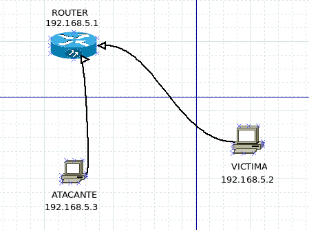

# Man in the middle attack
Este repositorio contiene todos los scripts y tutoriales necesarios para llevar acabo un ataque 'man in the middle'.


## Configuración del entrono de pruevas usando Vagrant
Para poder seguir los pasos descritos aquí, el primer requisito será descargar el repositorio en el ordenador. Para ello, debemos contar con la herramienta git. Una vez dispongamos de ella, podemos proceder a clonar el repositorio mediante el comando:
```
$ git clone https://github.com/JoseAngelMartinB/Man_in_the_middle.git
```

Para llevar a cabo la demostración del ataque, vamos a utilizar diversas máquinas virtuales. Dado que la configuración de dichas máquinas puede resultar compleja para un usuario novel, se ha decidido usar la herramienta Vagrant para crear y configurar el entorno. Por lo tanto, será necesario instalar dicho sofware, que puede ser descargado desde su [página oficial](https://www.vagrantup.com/).

Una vez descargado Vagrant, desde el directorio base del repositorio, ejecutamos el siguiente comando:
```
$ vagrant up
```

Mediante este comando Vagrant comenzará a descargar, montar y provisionar las distintas máquinas virtuales necesarias para la realización de esta demostración del ataque. Una vez vagrant ha terminado, dispondremos de 3 máquinas virtuales corriendo en nuestra máquina anfitrión. Una de ellas (la máquina víctima) dispone de entorno gráfico que es lanzado al ejecutar el comando anterior, sin embargo, las otras dos máquinas (router y atacante), no tienen entorno gráfico y deben ser accedidas usando ssh. Por ejemplo, para acceder a la máquina atacante, se ejecutará el siguiente comando:
```
$ vagrant ssh atacante
```

Una vez realizado los pasos anteriores tendremos el entorno de trabajo montado y configurado. Este entorno estará compuesto por una red interna, en la cual están conectadas las tres máquinas (router, víctima y atacante) en las direcciones ip *192.168.5.1*, *192.168.5.2* y *192.168.5.3* respectivamente. A partir de este momento, solo vamos a trabajar usando la máquina víctima (desde la interfaz gráfica) y la máquina atacante (desde la consola mediante conexión ssh).


## Descarga e instalación de las herramientas necesarias
Para poder realizar el ataque, es necesario instalar algunas herramientas en la máquina atacante. El uso de estas herramientas serán explicadas posteriormente. La primera de ellas será *arpspoof*, que nos permitirá realizar el ataque "man in the middle" propiamente dicho, mediante la falsifiación de paquetes ARP. La siguiente herramienta será *iptables*, que es un firewall de filtrado de paquetes del kernel de Linux (por lo que no será necesario instalarla). También se necesiará la herramienta *SSLSTrip*, la cual va a permitir convertir todo el HTTPS de una web en HTTP (sin cifrar) y por tanto engañar a la víctima, para obtener sus datos. Estos programás serán instalados usando lo siguientes comandos en la máquina atacante:
```
$ sudo apt-get update
$ sudo apt-get install dsniff sslstrip
```

Por último será necesario descargar la herramienta *Delorean*, la cual permitirá modificar los paquetes NTP que mande la víctima de forma que se pueda modificar la fecha de esta máquina. Para ello, en la máquina atacante debemos descargar el repositorio Github de la herramienta mediante:
```
$ git clone https://github.com/PentesterES/Delorean.git
```

Una vez realizados los pasos anteriores, podemos proceder a realizar el ataque.


## Ejecución del ataque
### Finalidad y explicación del ataque
La finalidad de este ataque es demostrar como poder saltarse la seguridad establecida por HSTS, la cual fuerza que las comunicaciones HTTP vayan sobre un canal TLS/SSL para hacer las mismas seguras. Para ello, vamos a trabajar con una idea muy sencilla y elegante que fue ideada José Selvi. Esta idea consiste en la utilización del protocolo NTP como herramienta de bypass para HSTS, lo cual conseguimos gracias a un esquema de Man in the middle (MITM), mediante el cual realizaremos modificaciones a los paquetes NTP destinados en un principio a la máquina víctima para hacer que dicho sistema viaje al futuro. De esta manera, se consigue que el TTL(Time to live) de la configuración HSTS caduque, y por tanto, la capa de seguridad que protege las conexiones HTTP queda eliminada. Una vez eliminada la seguridad de la conexión, haremos uso de la herramienta desarrollada por Moxie Marlinspike llamada SSLStrip, Esta, nos permitirá extraer información acerca de estas conexiones no seguras, obteniendo así todo tipo de información sobre las web que visita la víctima.

### Protocolos involucrados
- **NTP** -> Es utilizado para sincronizar la fecha y hora de un sistema, con unos pocos milisegundos de diferencia con respecto al tiempo UTC (Universal Time Coordinated). Puede estar implementado con varios modelos, como por ejemplo, el modelo cliente-servidor o peer-to-peer. NTP utiliza datagramas UDP y opera en el puerto 123. Además, NTP utiliza un sistema de jerarquías para sus fuentes de tiempo, donde cada capa es conocida como stratum. El stratum 0 corresponde al padre de todas las capas y está directamente ligado a los relojes atómicos que controlan la hora UTC.

- **ARP** -> Es el protocolo de resolución de direcciones, mediante el cual en una red interna se obtiene una dirección física a partir de una dirección IP.

- **HTTP** ->  Es un protocolo sin estado utilizado para realizar las transferencias en la World Wide Web.

- **HTTPS** -> Basado en HTTP y destinado a la transferencia segura de HTTP mediante el uso de un cifrado SSL/TLS que crea un canal de cifrado.

- **SSL/TLS** -> Son protocolos criptográficos que proporcionan comunicaciones seguras por una red. usan cifrados X.509 (asimétricos) para autenticar la contraparte con quien se estén comunicando, y para intercambiar una llave simétrica.

### Herramientas utilizadas
- **SSLSTRIP** -> Esta herramienta es capaz de "descifrar" el tráfico HTTPS y esnifar todo el tráfico (usuarios y claves) que viajen a través de la red en HTTPS. Realmente la herramienta no descifra el cifrado impuesto por SSL, sino que su función real es la de engañar al servidor y forzar que todo el tráfico HTTPS  pase a HTTP, el cual no esta cifrado.

- **DELOREAN** -> Es un servidor NTP escrito en python, con el que básicamente se puede realizar una captura de todo el trafico NTP, y realizar modificaciones en dichos paquetes, modificando la fecha que estos paquetes contienen. De esta manera se puede establecer una nueva fecha de sistema en la máquina víctima.


#### Modos de funcionamiento de delorean:
- **Automatico** -> Usado cuando no se especifica ningún párametro de entrada. Trabaja utilizando una fecha 1000 días posterior a la actual, manteniendo el mismo día y mes para evitar levantar sospechas.

- **Step Mode (-s)** -> En este modo se puede elegir cuantos segundos, horas o días queremos avanzar.

- **Date mode (-d)** -> Con este modo se puede elegir la fecha exacta a la que se quiere hacer viajar a la víctima.

- **Random mode (-r)** -> El programa comenzará a enviar fechas aleatorias al sistema víctima.

- **Skimming Attack (-k & -t)** -> Este modo funciona de 2 formas. Por un lado con -k avanza al futuro en varios pasos en lugar de en uno solo. La opcion -t lo que nos permite es usar los saltos en el tiempo establecidos con -k pero esta vez retrocediendo hacia el pasado, Por lo tanto podríamos reutilizar viejos certificados ya caducados en la máquina víctima.

### Vulnerabilidades de los sistemas operativos:
- **Ubuntu Linux** -> No tiene un demonio NTP corriendo por el mismo, pero utiliza una configuración por defecto via 'ntpdate'. Este comando hace una petición cada vez que una interfaz de red se levanta. Utiliza NTPv4 sin autenticación, por tanto vulnerables a MITM.

- **Fedora Linux** -> Al contrario que en Ubuntu, Fedora si utiliza un demonio NTP llamado 'chronyd', el cual hace sincronizaciones cada minuto. Utiliza NTPv3 sin autenticación, de modo que es vulnerable a ataques MITM.

- **Mac OS X Lion** -> Este sistema operativo, cuenta con un demonio NTP llamado 'ntpd', el cual sincroniza cada 9 minutos y utiliza NTPv4 sin autenticación, por tanto también es vulnerable.

- **Microsoft Windows** -> Este es el sistema operativo con la implementación más segura de NTP. Tampoco utiliza autenticacion, pero implementa algunas características adicionales que aportan un extra de seguridad y de dificultad para realizar el ataque. Su periodo de sincronizacion está entorno a 1 semana. La segunda característica de seguridad son los parámetros 'MaxPosPhaseCorrection' y 'MinPosPhaseCorrection', situados en el registro de Windows y que especifican el máximo y el mínimo tiempo en segundos que el reloj puede ser reajustado con una sincronizacion. Estos valores están entorno a unas 15 horas. Esto deja una estrecha posibilidad para realizar un ataque ya que, salvo que el usuario tenga modificado el valor de 'MaxPosPhaseCorrection', no podremos llevar a cabo este ataque. Otro dato interesante es que si forzamos a que el usuario realice una petición de forma manual no se aplicaran ninguna de estas restricciones y será vulnerable.

### Fortalezas y debilidades de HSTS
Esta política de seguridad fue ideada para evitar que se pudieran llevar a cabo los ataques de SSLStrip y que alguien pudiera robarnos información con ello. Con este método se asegura que nunca se va a navegar con HTTP ya que el servidor web declara que los navegadores utilizados (agentes de usuario), solo puedan navegar sobre este protocolo HTTPS.

El problema que tiene esta medida de seguridad, es que tiene un tiempo de vida establecido, correspondiente al de los certificados. Gracias a la herramienta Delorean, podemos hacer que esta seguridad desaparezca, siendo susceptible entonces a un ataque SSLStrip

### Vulnerabilidad de NTP
NTPv4 soporta autenticación basada en cifrado asimétrico en su capa Message Digest, la cual impide que el timestamp sea modificado. El servidor firma el mensaje NTP usando su clave privada, por tanto el cliente podrá verificar la integridad del mensaje, y por tanto no puede realizarse un ataque de MITM. Pero prácticamente ningún sistema operativo implementa este sistema de autenticación.


### Contextualización del ataque
En nuestro entorno de pruebas contaremos con una máquina víctima, un atacante y un router. Sobre este esquema la idea será capturar todos los paquetes provenientes de la víctima a través de HTTP y NTP, para primero mediante el uso del Delorean modificar la fecha de la máquina víctima, de tal manera que no tenga validez su TTL, con lo que quedará expuesta a un ataque de SSLStrip.




### Inicializando el entorno de prueba
Lo primero a realizar será la puesta en marcha de nuestro entorno, para ello se debe ejecutar el siguiente comando como fue explicado anteriormente.
```
$ vagrant up
```

Una vez finalizada la ejecución del comando ya tendremos el entorno preparado para empezar a probar el ataque. Veremos como nos ha levantado una máquina virtual con GUI (la víctima) y 2 sin ella (router y atacante).

#### Ejecución desde máquina atacante
Desde la terminal que utilizamos para levantar nuestro entorno y accedemos a la máquina atacante mediante SSH:
```
$ vagrant ssh atacante
```

### Realización del MITM
#### ¿En qué consiste el ataque MITM?
El objetivo de dicho ataque es conseguir situarse en medio de la máquina víctima y la máquina router. Para lograr esto, debemos hacer creer al router que nuestra máquina atacante es la víctima, y conseguir también que la víctima piense que nosotros somos el router.

#### Ejecutando el MITM
Para situar la máquina atacante en medio de la comunicación entre el router y la víctima, debemos modificar las caches ARP de las máquinas víctima y router. Esto lo conseguimos a través de un ataque ARP spoof con el cual bombardeamos tanto al router como a la víctima de mensajes ARP comunicando a cada uno que somos el otro (su IP corresponde con nuestra direción MAC).

Le decimos al router que nosotros somos la máquina víctima:
```
$ sudo arpspoof -i enp0s8 -t 192.168.5.2 192.168.5.1
```
Le decimos a la víctima que nosotros somos el Router:
```
$ sudo arpspoof -i enp0s8 -t 192.168.5.1 192.168.5.2
```

Una vez realizado, si observamos en la cache de la máquina víctima veríamos como la dirección MAC del router ha sido suplantada por la de nuestra máquina atacante. De igual manera pasará en el caso del router, quedando el esquema de las comunicaciones en nuestro entorno de pruebas queda tal como vemos en la siguiente imagen.


#### Interceptar paquetes NTP con Delorean
Ya hemos llevado a cabo el MITM y por tanto estamos en posición de empezar a capturar y modificar los paquetes que necesitamos para este ataque, que en este caso son paquetes NTP.

Para poder capturar los paquetes NTP necesitamos configurar una regla con iptables mediante la cual le diremos que no pueda hacer FORWARD de paquetes NTP. De tal forma que quedarán todos los paquetes en nuestra máquina atacante, que será la encargada de modificar y reenviar estos paquetes a la víctima.
```
$ sudo iptables -t nat -A PREROUTING -i enp0s8 -p udp --dport 123 -j REDIRECT --to-port 123  
```

Comprobaremos que la regla se guardo satisfactoriamente con ```sudo iptables-save``` y después se lanzará el programa Delorean, el cual podemos ejecutar en otra terminal. A partir de entonces, solo será cuestión de tiempo hasta que la máquina víctima realice una petición NTP y su fecha quede mofificada.
```
$ ./delorean.py
```

A partir de ese momento, podremos apreciar como la herramienta Delorean ha comenzado a reenviar los paquetes NTP con fecha cambiada (por defecto 1000 días posterior a la actual).

#### Poner en funcionamiento SSLStrip
##### Redirecciones para SSLStrip
Para poder perpetrar este ataque mediante SSLStrip, tenemos que hacer una última configuración en el firewall de la máquina atacante, que consistirá en redireccionar todo el trafico que vaya por el puerto 80 y enviarlo al puerto 8080, que es donde se va a configurar que escuche nuestro SSLStrip. Para esto, estableceremos un nueva regla como la que vemos aquí:
```
$ sudo iptables -t nat -A PREROUTING -p tcp --dport 80 -j REDIRECT --to-port 8080
```

##### Capturando datos con SSLStrip
Todo lo realizado hasta ahora es lo necesario para poder saltarnos la seguridad añadida por SSL/TLS que nos impedía realizar un ataque SSLStrip, pero ahora gracias al Delorean hemos forzado la caducidad de su sesión TTL y, por tanto, podemos forzar de nuevo al navegador de la víctima a navegar a través de HTTP y ser susceptible a SSLStrip. De manera que a partir de este momento, ya podremos obtener mediante el sniffer los usuarios y contraseñas de todos los sitios web donde acceda la víctima. Se ejecutará el snifer con el siguiente comando:
```
$ sslstrip -l 8080 -w caputra.txt
```

Para obtener los resultados de la captura, se puede ejecutar:
```
$ cat caputra.txt
```

## Referencias


## Autores
* José Ángel Martín Baos
* Óscar Pérez Galán


## AVISO LEGAL Y DESCARGO DE RESPONSABILIDAD:
Toda la información, enlaces y herramientas de este sitio web tiene estricto carácter formativo. Los autores NO aceptan ninguna responsabilidad por las posibles consecuencias, intencionadas o no, de las acciones realizadas mediante el uso de los materiales expuestos.

----------------------------------------------------
Seguridad en Redes - 2017 <br>
Escuela Superior de Informática <br>
Universidad de Castilla-La Mancha (Spain)
